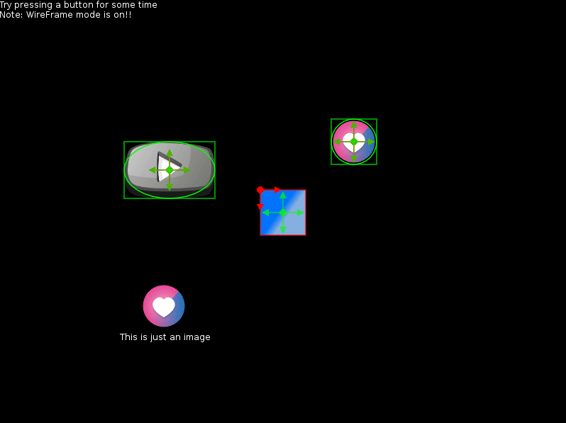

# Lavis Minimal

Lavis is a GUI library for Love2D which is *kinda like loveframes but for games*. That's it's punchline

<p align='center'>
<a href="screens/minimal demo.gif" title="Click to view the Image in Full Resolution">
<br/>
</a>

## Table of Contents

- [How to use?](#how-to-use)
- [Create your game's GUI within minutes](#create-your-games-gui-within-minutes)
- About Lavis
  - [About the name](#about-the-name)
  - [Why retained-mode?](#why-retained-mode)
  - [Lavis is responsive](#lavis-is-responsive)
- [Documentation](#documentation)


### How to use?

To use Lavis, you would simply copy the folder lavis to some other folder in your game - let's say 'lib' - which should be in the same directory as main.lua and then you'd simply say:-

```lua
require 'lavis'
```

It is assumed that the folder lavis contains the `init.lua` file! Alternatively you can also use Lavis as a module just rename it from `init.lua` to something like `lavis.lua` and move it one directory up and follow the same step as before!

### Create your game's GUI within minutes


### About the name

Lavis doesn't come from the Jeans brand "Levi's". Lavis actually comes from 'lavish' meaning 'generous.' (BTW the pronunciation of Lavis is - Laaavish but you can also say 'levis', doesn't matter) Unlike other retained GUI library Lavis doesn't punish you by consuming a lot of memory also it work very nicely with all kinds of state machines (something that LoveFrames can't boast of)

### Why retained-mode?

ImGUIs are gaining a lot of popularity nowadays because of the ease of creating them and also because they are much faster to create then the `retained-mode` GUIs. But retained-mode has their own advantages even in context of game-development first one being the learning curve- ImGUIs can sometimes be confusing whereas retained-mode are crystal-clear - like the button is not showing itself because you had hidden it before rendering compared to *the button there is not showing because it shares the same GEN_ID with a invisible widget*! **Also retained-mode GUIs are lightning fast when compared to imguis!**

And believe it or not but retained-mode GUIs are preffered over ImGUIs in context of casual-game development. Cause casual game developers are mostly web-developers and are more comfortable with the `addEventListener` sort of paradigm than they are with those GEN_IDs or whatever.

Note that I'm not advocating you shouldn't use ImGUIs. I'm only saying retained-mode GUIs has their own advantages and ImGUIs can be super-useful to perhaps create a prototype quickly or maybe for very dynamic games! But for casual games I believe retained-mode GUIs are better solution!

### Lavis is responsive

Lavis is a responsive retained-mode GUI! Well what do I mean by that! See for yourself

<p align='center'>
<a href="screens/responsive.gif" title="Click to view the Image in Full Resolution">
<br/>
</a>


## Documentation

~~The documentation can be found [here](). Alternatively you can also *build* the docs in the [docs]() branch!~~
Sorry the documentation will take some time (I'm working on it and will upload it soon)
